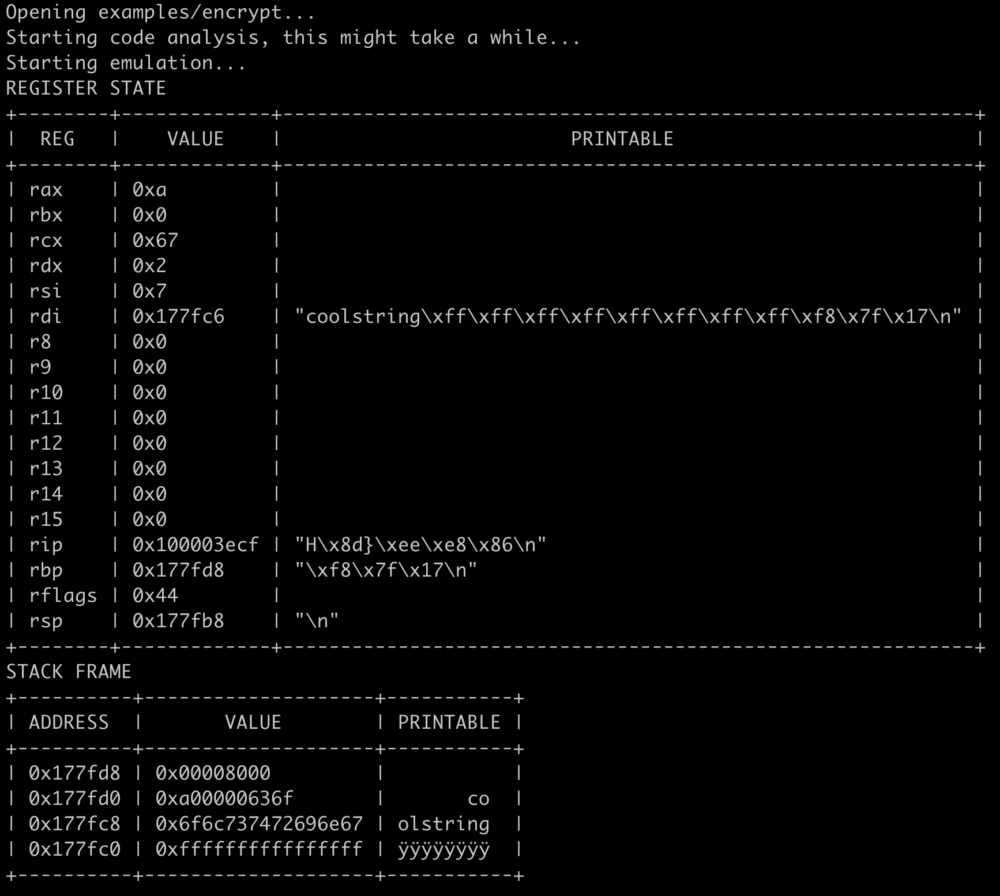

# Bino - A emulation tool for your RE arsenal 💻


Bino it's a binary emulation tool written in Golang and powered by Radare that is able to emulate executable instructions from PE, ELF and Mach-O. It can be used to evaluate encryption and decryption routines, check the CPU state in some block of code and to "execute" different architecture code and acelerate a lot of reverse engineering tasks. 

[](https://github.com/0xc0ffeec0de/Bino/actions/workflows/go.yml)

## Example usage

Start the emulation from the `main` symbol that was found by the radare code analysis, and emulate every instruction until hit the `puts` call.

> bino emulate examples/encrypt --start-at main --until-call puts --log



And the code emulated was:

```c
void decrypt() {
  char output[enc_data_size] = { 0 };

  for (int i = 0; i < enc_data_size; ++i) {
    output[i] = enc_data[i] ^ enc_key[i % enc_key_size];
  }

  // print the call arguments
  puts(output);
}
```

## Installation

In order to install you will need, 

* [radare2](https://github.com/radareorg/radare2) 
    - from their github repository, this will make sure to have the last features and 
    fixes. 

* Golang (temporary)
    - For source code compilation, until the release is ready.


After install radare2, you can install simple by typing:

```
$ go get github.com/0xc0ffeec0de/Bino
$ echo export PATH=$PATH:$(go env GOPATH)/bin/ >> ~/.bashrc
```

This will make sure that your shell load the correct executable path everytime, if you are using `zsh` change the `.bashrc` to `.zshrc`.